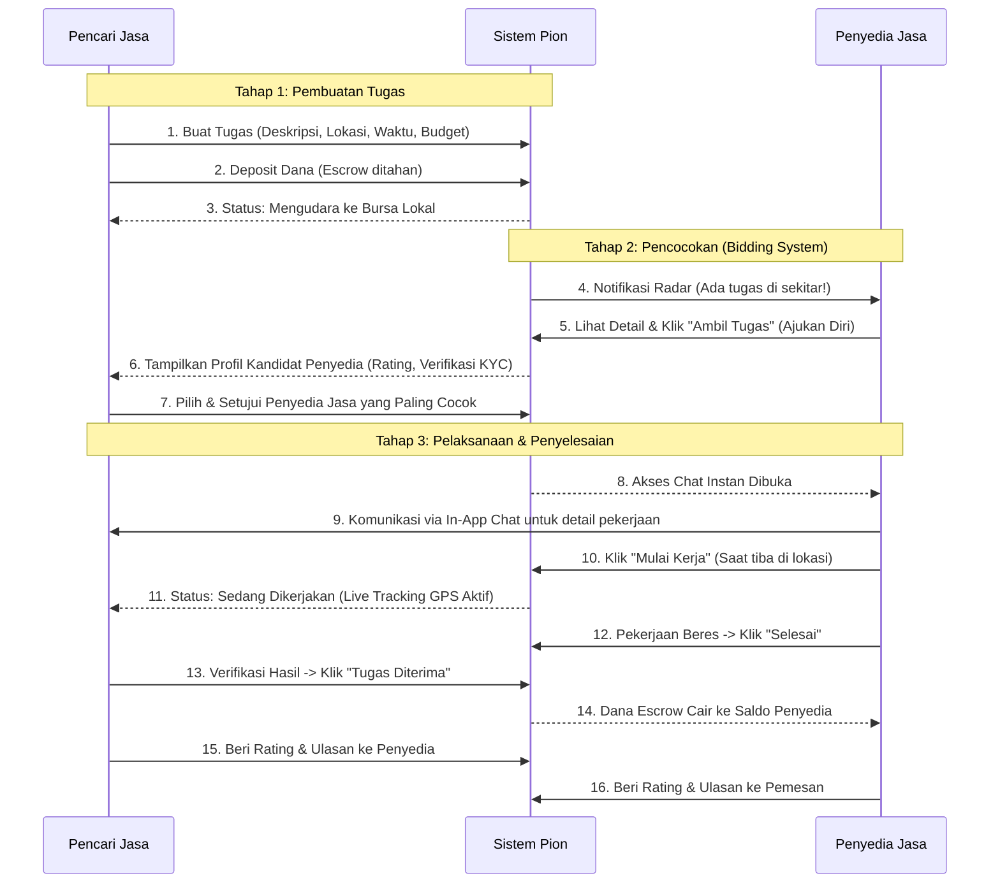

# Software Design Document (SDD) - Pion
**Aplikasi Jasa Hiperlokal & Pendampingan Cepat**

## 1. Pendahuluan
Dokumen ini menguraikan arsitektur dan spesifikasi desain untuk aplikasi **Pion**, sebuah platform yang menghubungkan pencari jasa dengan penyedia jasa secara hiperlokal (berbasis lokasi terdekat).

## 2. Core Functions (Fitur Utama)

### A. Pilar Keamanan & Kepercayaan (Trust & Safety)
*   **KYC (Know Your Customer) & Verifikasi Identitas:** Verifikasi KTP dan *liveness check* (swafoto) bagi Penyedia Jasa untuk mendapatkan badge "Terverifikasi".
*   **Sistem Pembayaran Penampung (Escrow):** Dana dari pemesan ditahan di dompet in-app Pion dan diteruskan ke penyedia jasa setelah tugas dikonfirmasi selesai oleh kedua pihak.
*   **Tombol Darurat (SOS):** Terintegrasi khusus di halaman aktif tugas yang terhubung langsung ke layanan keamanan, polisi, atau kontak darurat pribadi.

### B. Pilar Operasional Hiperlokal (Core Logic)
*   **Geofencing & Integrasi Maps:** Menampilkan ketersediaan tugas dan penyedia jasa dalam radius hiperlokal (misal: 1-5 km) menggunakan GPS secara real-time.
*   **Kategorisasi Fleksibel (Dynamic Tags):** Input tugas berupa *free-text* yang diubah oleh sistem pencarian dinamis menjadi tagar (misal: `#Perbaikan`, `#TemanJalan`, `#BantuAngkat`).
*   **Real-time Chat & Location Tracking:** In-app messaging dan pelacakan koordinat GPS *live* saat tugas berjalan untuk menjaga privasi pengguna (tidak perlu bertukar nomor WhatsApp).

### C. Pilar Reputasi
*   **Rating & Ulasan Spesifik:** Penilaian berbasis parameter spesifik dan tag keahlian bukan sekadar bintang (misal: "Sangat Tepat Waktu", "Sopan", "Bekerja Cepat", "Sangat Membantu").

---

## 3. Flow Process (Alur Kerja Pengguna)

Berikut adalah visualisasi alur kerja dari sudut pandang pemesan (Pencari Jasa) hingga penyelesaian tugas:

---

## 4. Mekanisme Pencocokan (Tahap 2): Analisis & Keputusan

Terkait mekanisme pada Tahap 2, **sangat direkomendasikan untuk menggunakan sistem "Bidding/Lelang Terbatas"** (Penyedia menawarkan diri, Pencari Jasa memilih), dan **menghindari sistem "Siapa Cepat Dia Dapat"**. 

**Alasan Utama (Fokus pada Trust & Safety):**
1.  **Kontrol Penuh di Tangan Pengguna (Pencari Jasa):** Karena ini menyangkut interaksi fisik di dunia nyata (mendatangkan orang ke rumah atau pendampingan), pencari jasa **wajib** memiliki kebebasan untuk melihat profil, melihat seberapa tinggi rating-nya, dan membaca *review* sebelumnya sebelum mengizinkan orang tersebut mengambil tugas.
2.  **Mencegah Bot dan Akun "Asal Ambil":** Sistem *Siapa Cepat Dia Dapat* sering kali dieksploitasi oleh bot auto-click atau orang yang belum membaca detail tugas dengan baik tetapi langsung menekan tombol "Terima".
3.  **Kesesuaian Keahlian:** Melalui sistem bidding/lelang, pencari jasa bisa memilih individu dengan tag rating yang paling relevan (misal, untuk tugas memperbaiki pipa, ia bisa memilih orang dengan tag `#AhliAir`).

**Flow Implementasi (Bidding Terbatas):**
Agar cepat, sistem bisa membatasi jumlah penyedia yang bisa menekan "Ambil Tugas" hingga **maksimal 3-5 orang pertama**. Kemudian, pencari jasa memilih satu dari mereka. Ini menyeimbangkan antara kecepatan (respons hiperlokal) dan keamanan (hak verifikasi pemesan).

---

## 5. Pendekatan Teknis & Arsitektur

Untuk memenuhi kebutuhan platform yang sangat dinamis, latensi rendah, dan lintas platform, berikut adalah tumpukan teknologi (Tech Stack) yang diusulkan:

*   **Frontend (Mobile App):** `Flutter` (Dart)
    *   *Alasan:* *Single codebase* untuk kompilasi native ke iOS dan Android, menjaga UI/UX tetap mulus dan konsisten, serta sangat cocok untuk membangun peta dan *custom views* yang dinamis.
*   **Backend & API Server:** `Node.js` (Express/NestJS) atau `Go (Golang)`
    *   *Alasan:* Keduanya sangat mumpuni dalam menangani banyak koneksi asinkron (misalnya untuk fitur *real-time chat* dan *live tracking*). Go sangat disarankan jika traffic geo-lokasi sangat tinggi.
*   **Database Relasional:** `MySQL` atau `PostgreSQL`
    *   *Alasan:* Menjaga integritas transaksional (ACID). Sangat krusial untuk fitur *Escrow Wallet* agar tidak ada uang yang "hilang" akibat *race conditions*. PostgreSQL memiliki keunggulan tambahan dengan ekstensi `PostGIS` untuk mempermudah perhitungan *geofencing* radius.
*   **Infrastruktur & Hosting:** `Microsoft Azure` atau `AWS`
    *   Virtual Machines / Container Instances dengan `Nginx` sebagai Reverse Proxy dan Load Balancer untuk merutekan traffic API dengan aman dan stabil.
*   **Location & Mapping API:** `Google Maps SDK` (untuk Flutter) atau `Mapbox`.
*   **Real-time Engine:** `Socket.io` atau `Firebase Realtime Database` (digunakan spesifik hanya untuk chat dan pembaruan GPS *live*).

---

## 6. Mockup User Interface (UI)

Berikut adalah visualisasi antarmuka aplikasi Pion untuk mempermudah pemahaman pengalaman pengguna:

### Layar 1: Beranda & Radar Peta (Pencari Jasa)
Pencari jasa melihat peta lokasi, radar penyedia jasa di sekitarnya, serta kotak pencarian fleksibel untuk berbagai tagar.

### Layar 2: Pembuatan Tugas (Pencari Jasa)
Formulir *clean design* untuk mendeskripsikan tugas, menetapkan waktu, titik lokasi, dan menempatkan dana deposit.

### Layar 3: Dashboard & Radar (Penyedia Jasa)
Tampilan mode gelap (*dark mode*) khusus penyedia jasa untuk melihat notifikasi radar dan menekan tombol untuk mengambil/bid tugas.

---
*Dokumen dirancang untuk menjadi dasar pengembangan awal Aplikasi Pion.*
